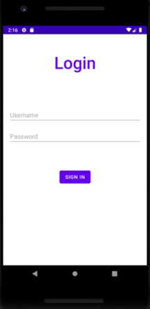
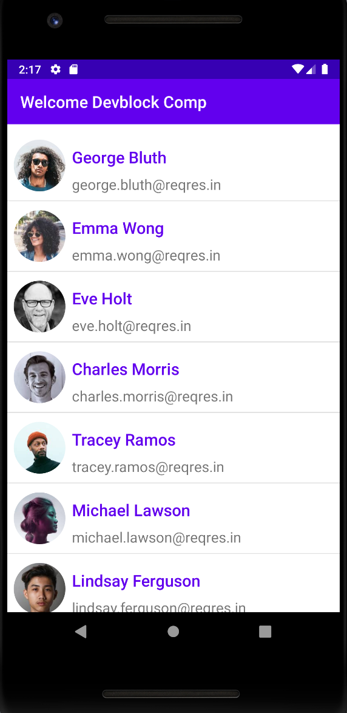
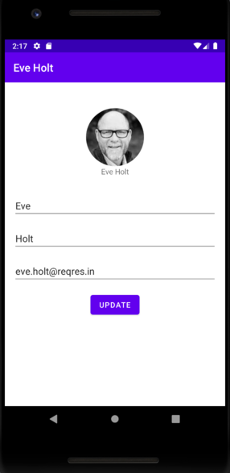

MyContacts
=================
A simple Contacts List with basic features: login, pagination list, update item in list

Architecture & Libraries Used
--------------

- Architecture: Clean Architecture, MVVM
- Libraries:
    * Retrofit: REST client for Java & Android
    * Hilt: for Dependency Injection
    * LiveData: is an observable data holder class.
    * Coroutines:  A coroutine is a concurrency design pattern that you can use on Android to
      simplify code that executes asynchronously...
    * Glide: for loading image
    * DiffUtil: calculate the difference between two list and updates the RecyclerView with
    suitable notify methods
    * Android Jetpack's Navigation: implement navigation in app

Screenshots
-----------

